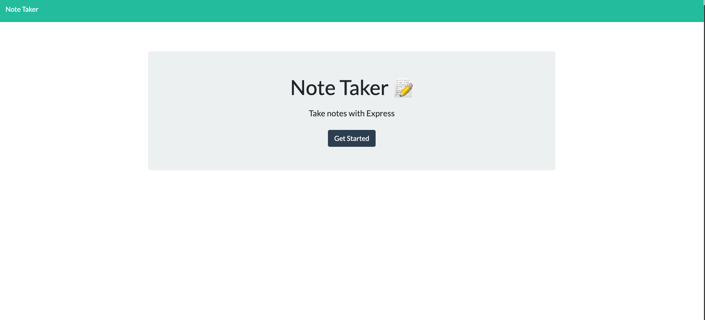

# the-note-taker

## Table of Contents 
* [Description](#description)
* [Installation](#installation-of-repo)
* [Usage](#usage)
* [Contributing](#contributing)
* [Questions](#questions)
* [Screenshot](#screenshot)
* [Walk-Through-Video](#walk-through-vid)
* [Credits](#credits)
* [License](#license)

## Description
This application is designed to write, save, and delete notes. It uses an express backend and saves and retrieves note data from a JSON file. 

## Installation
Follow these steps to view the application!
1. Open link in github. - https://github.com/xdanielmtz/the-note-taker
2. Clone with SSH
3. Run "git clone" command in Terminal with the pasted link
4. Run "code ." command to open in VS Code.
5. Run 'npm install' to install all dependencies 
6. Run 'npm start' to initialize the server on your local if you wish to view it there.
7. Enjoy

## Usage
When going to the application site, you will be presented with the beautifully designed homepage with a 'Get Started' button.
Once you click on 'Get Started', you can begin to write your desired noted on the right hand side of the page. 
When finished with your note, click on the save icon on the upper right side of the page. 
You will notice your note be saved to a list on the left side of your page. 
You can then delete your note by clicking on the trash icon next to your note. 
Upon reloading the page again, you will notice your notes are still there. :)

## Contribution 
IF you wish to contribute, here is how:
GO to my repo and fork my repository.
CLONE with ssh and view it on your local machine.
WHEN you have made your contributions, run git push and I will review for a merge.

## Questions
If you have any questions contact me through email, xdanielmtz@gmail.com
Also here is my github profile, https://github.com/xdanielmtz

## Screenshot

## Walk-through Vid:
https://drive.google.com/file/d/1lfuchDZQt3keFonIeiy7kqmC7tvnI5MH/view

## Credits 
I would like to give credit to my instructor as always, Jonathan Watson. He provided me with the information required to complete this project. 
My tutor, Andres Long deserves some credit as well for this as he guided me along. 

## License 
MIT License

Copyright (c) 2020 xdanielmtz

Permission is hereby granted, free of charge, to any person obtaining a copy
of this software and associated documentation files (the "Software"), to deal
in the Software without restriction, including without limitation the rights
to use, copy, modify, merge, publish, distribute, sublicense, and/or sell
copies of the Software, and to permit persons to whom the Software is
furnished to do so, subject to the following conditions:

The above copyright notice and this permission notice shall be included in all
copies or substantial portions of the Software.

THE SOFTWARE IS PROVIDED "AS IS", WITHOUT WARRANTY OF ANY KIND, EXPRESS OR
IMPLIED, INCLUDING BUT NOT LIMITED TO THE WARRANTIES OF MERCHANTABILITY,
FITNESS FOR A PARTICULAR PURPOSE AND NONINFRINGEMENT. IN NO EVENT SHALL THE
AUTHORS OR COPYRIGHT HOLDERS BE LIABLE FOR ANY CLAIM, DAMAGES OR OTHER
LIABILITY, WHETHER IN AN ACTION OF CONTRACT, TORT OR OTHERWISE, ARISING FROM,
OUT OF OR IN CONNECTION WITH THE SOFTWARE OR THE USE OR OTHER DEALINGS IN THE
SOFTWARE.
